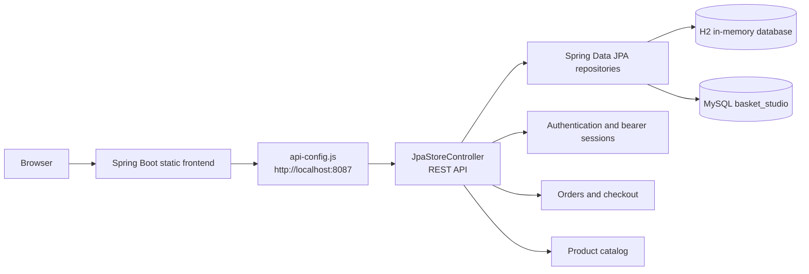

# BasketStudio-Ecommerce

# Basket Studio

> A premium grocery shopping application with a responsive storefront, basket checkout, user profiles, order history, and a Spring Boot backend.

## GitHub Description

Premium grocery shopping app built with Spring Boot, Hibernate, JPA, MySQL, and a responsive HTML/CSS/JavaScript frontend.

## Features


## Technology Stack

### Backend


### Database


### Frontend


## Requirements

Install Java 21, Maven, and MySQL 8 if you want to use the MySQL profile. H2 is included for the simplest local run.

Check your installations:

```powershell
java -version
mvn -version
mysql --version
```

## Download the Project

Clone the repository:

```powershell
git clone <YOUR_GITHUB_REPOSITORY_URL>
cd BigBasket-main
```

The Maven project is inside the nested `BigBasket-main` directory in this workspace:

```powershell
cd BigBasket-main
```

You should see `pom.xml`, `src`, and `database` in the current directory.

## Run Locally from Start to Finish

The default profile uses an in-memory H2 database, creates the tables automatically, and seeds the products. No MySQL setup is required.

### 1. Open the Maven project

```powershell
cd D:\BigBasket-main\BigBasket-main
```

### 2. Build the application

```powershell
mvn clean package -DskipTests
```

### 3. Start the application

```powershell
mvn spring-boot:run
```

The server uses port `8087` by default. Keep this terminal running.

### 4. Open the frontend

Open [http://localhost:8087](http://localhost:8087) in your browser.

### 5. Stop the application

Press `Ctrl+C` in the terminal running Spring Boot.

### Run Locally with H2

H2 is the easiest way to test the application without configuring MySQL. Data is recreated when the application restarts.

```powershell
cd D:\BigBasket-main\BigBasket-main
mvn spring-boot:run
```

The H2 development profile uses:

```text
Database URL: jdbc:h2:mem:basket_studio
Username: sa
Password: empty
```

## Configure MySQL

### Option A: Execute the complete schema

Open [database/schema-mysql.sql](database/schema-mysql.sql) in MySQL Workbench and execute it. The script creates:


### Option B: Create an application database user

For local development, use a separate application user instead of the MySQL `root` account. Open [database/create-app-user.sql](database/create-app-user.sql), replace the placeholder password, and execute it in MySQL Workbench as an administrator.

Then set the credentials in PowerShell:

```powershell
$env:DB_USERNAME="basket_app"
$env:DB_PASSWORD="the_password_you_set"
```

### Start with MySQL

Set these variables in the same PowerShell window where you start Maven. Replace the password placeholder with your actual local MySQL password; do not put it in `application-mysql.properties`.

```powershell
cd D:\BigBasket-main\BigBasket-main
$env:DB_USERNAME="root"
$env:DB_PASSWORD="your_mysql_password"
mvn spring-boot:run "-Dspring-boot.run.profiles=mysql"
```

Confirm that the variables are set without displaying the password:

```powershell
if ([string]::IsNullOrWhiteSpace($env:DB_USERNAME) -or [string]::IsNullOrWhiteSpace($env:DB_PASSWORD)) {
  throw "Set DB_USERNAME and DB_PASSWORD in this PowerShell window before starting MySQL profile."
}
```

The MySQL profile connects to:

```text
Host: localhost
Port: 3306
Database: basket_studio
```

The connection settings are in [application-mysql.properties](src/main/resources/application-mysql.properties). Credentials are read from environment variables and should not be committed to GitHub.

## MySQL Troubleshooting

### Unknown database `basket_studio`

Execute the database script first:

```sql
CREATE DATABASE IF NOT EXISTS basket_studio;
```

The application URL also includes `createDatabaseIfNotExist=true`.

### Access denied for user `root`

This means MySQL rejected the password or no password was supplied. The log message `using password: NO` means `$env:DB_PASSWORD` was not set in the current PowerShell window. Set the credentials again, then run:

```powershell
$env:DB_USERNAME="root"
$env:DB_PASSWORD="your_mysql_password"
mvn spring-boot:run "-Dspring-boot.run.profiles=mysql"
```

Alternatively, create the dedicated `basket_app` user using [database/create-app-user.sql](database/create-app-user.sql), then set its credentials:

```powershell
$env:DB_USERNAME="basket_app"
$env:DB_PASSWORD="your_application_user_password"
mvn spring-boot:run "-Dspring-boot.run.profiles=mysql"
```

Verify access in MySQL Workbench:

```sql
SELECT USER(), CURRENT_USER();
USE basket_studio;
SHOW TABLES;
```

### Port 8087 already in use

Find the process using port 8087:

```powershell
Get-NetTCPConnection -LocalPort 8087 -State Listen
```

Stop only the stale application process if necessary, then run Spring Boot again.

## API Endpoints

### Products

| Method | Endpoint | Purpose |
| --- | --- | --- |
| `GET` | `/api/products` | List all products |
| `GET` | `/api/products?category=Fruits` | Filter products |
| `GET` | `/api/products/{id}` | Read one product |
| `POST` | `/api/products` | Create a product |
| `PUT` | `/api/products/{id}` | Update a product |
| `DELETE` | `/api/products/{id}` | Delete a product |

Example product request:

```json
{
  "id": "mango",
  "name": "Alphonso Mangoes",
  "category": "Fruits",
  "price": 120,
  "image": "mango.jpg",
  "tagline": "Golden seasonal sweetness"
}
```

### Authentication

| Method | Endpoint | Purpose |
| --- | --- | --- |
| `POST` | `/api/auth/signup` | Register a user |
| `POST` | `/api/auth/login` | Login and receive a bearer token |
| `POST` | `/api/auth/logout` | Invalidate the bearer token |
| `GET` | `/api/profile` | Read the authenticated profile |

### Orders

Authenticated requests require:

```text
Authorization: Bearer YOUR_TOKEN
```

| Method | Endpoint | Purpose |
| --- | --- | --- |
| `POST` | `/api/orders` | Create an order |
| `GET` | `/api/orders` | List the signed-in user's orders |
| `GET` | `/api/orders/{id}` | Read one user's order |
| `DELETE` | `/api/orders/{id}` | Delete one user's order |

## Project Structure

```text
BigBasket-main/
├── database/
│   ├── create-app-user.sql       # MySQL application user setup
│   └── schema-mysql.sql          # Database, tables, indexes, and seed products
├── src/
│   ├── main/
│   │   ├── java/com/bigbasket/
│   │   │   ├── BasketStudioApplication.java  # Spring Boot entry point and seed runner
│   │   │   ├── JpaStoreController.java       # REST API and business flow
│   │   │   ├── UserEntity.java                # User JPA entity
│   │   │   ├── ProductEntity.java             # Product JPA entity
│   │   │   ├── OrderEntity.java               # Order JPA entity
│   │   │   ├── OrderItemEntity.java           # Order item JPA entity
│   │   │   ├── UserRepository.java            # User persistence queries
│   │   │   ├── ProductRepository.java         # Product persistence queries
│   │   │   └── OrderRepository.java           # Order persistence queries
│   │   └── resources/
│   │       ├── application.properties        # Default H2 configuration
│   │       ├── application-mysql.properties   # MySQL configuration
│   │       └── static/
│   │           ├── index.html                 # Main storefront
│   │           ├── app.js                    # Basket, auth, and checkout logic
│   │           ├── style.css                 # Main storefront styles
│   │           ├── login.html                 # Login page
│   │           ├── login.js                   # Login API integration
│   │           ├── profile.html                # Profile and order history page
│   │           ├── profile.js                  # Profile API integration
│   │           ├── profile.css                 # Profile styles
│   │           ├── assets/                     # Product and hero images
│   │           └── *.html / *.css              # Compatibility pages and shared styles
├── pom.xml
└── README.md
```

## Application Architecture



## Frontend Pages

### 1. Storefront and catalog

The main storefront is available at [http://localhost:8087](http://localhost:8087). It displays products, supports fruit and vegetable category views, and manages the shopping basket and checkout flow.

Related pages:

- [Fruits catalog](http://localhost:8087/fruits.html)
- [Vegetables catalog](http://localhost:8087/vegetables1.html)
- [Basket checkout](http://localhost:8087/BasketPaymentForm.html)

### 2. Profile and order history

The profile page is available at [http://localhost:8087/profile.html](http://localhost:8087/profile.html). After login, it displays the user profile and order history.

Related pages:

- [Login](http://localhost:8087/login.html)
- [Signup](http://localhost:8087/signup.html)
- [Profile and orders](http://localhost:8087/profile.html)

## Important Frontend URLs

```text
http://localhost:8087/                 Main storefront
http://localhost:8087/login.html       Login page
http://localhost:8087/signup.html      Registration entry page
http://localhost:8087/profile.html     Profile and order history
http://localhost:8087/fruits.html      Fruits catalog view
http://localhost:8087/vegetables1.html Vegetables catalog view
```

## Build and Package

Create the executable Spring Boot JAR:

```powershell
cd D:\BigBasket-main\BigBasket-main
mvn clean package
```

Run the packaged application with H2:

```powershell
java -jar target\basket-studio-1.0.0.jar
```

Run the packaged application with MySQL environment variables:

```powershell
$env:DB_USERNAME="basket_app"
$env:DB_PASSWORD="your_application_user_password"
java -jar target\basket-studio-1.0.0.jar --spring.profiles.active=mysql
```

## Security Notes


## License

Add the license selected for your GitHub repository before publishing.

## Publish to GitHub

Run these commands from the folder containing `pom.xml`:

```powershell
cd D:\BigBasket-main\BigBasket-main
git init
git add .
git commit -m "Initial Basket Studio application"
git branch -M main
```

Create an empty repository on GitHub, then replace the placeholders:

```powershell
git remote add origin https://github.com/YOUR_USERNAME/YOUR_REPOSITORY.git
git push -u origin main
```

GitHub may require a Personal Access Token instead of your account password. Never commit database passwords, `.env` files, or OAuth secrets.

## Deploy Online

Vercel serves the static HTML, CSS, JavaScript, and images, but it does not run this Spring Boot JVM server as a persistent backend. Deploy the project as two connected services:

1. Deploy Spring Boot to Render, Railway, Fly.io, or another Java-capable host.
2. Deploy the frontend to Vercel.
3. Configure the frontend to call the public backend URL.
4. Configure backend CORS to allow the Vercel domain.
5. Configure the backend with a managed MySQL database.

### Backend host settings

```text
Build command: mvn clean package
Start command: java -jar target/basket-studio-1.0.0.jar --spring.profiles.active=mysql
```

Set these environment variables on the backend host:

```text
DB_URL=jdbc:mysql://MYSQL_HOST:3306/basket_studio?useSSL=true&serverTimezone=UTC
DB_USERNAME=basket_app
DB_PASSWORD=your_database_password
```

Execute [database/schema-mysql.sql](database/schema-mysql.sql) in the managed MySQL database before starting the backend. Use a separate database user from `database/create-app-user.sql` and do not expose its password in GitHub.

### Vercel settings

1. Open Vercel and choose **Add New Project**.
2. Import the GitHub repository.
3. Leave the project root directory as the repository root. The included `vercel.json` routes the static frontend from `src/main/resources/static`.
4. Choose **Other** as the framework preset.
5. Leave the build command empty and use `.` as the output directory.
6. Deploy.

The Vercel site will serve the UI. Login, profile, and checkout will work after the backend URL is configured in `api-config.js`.

### Frontend API URL

The current frontend uses relative `/api` requests because it normally runs from Spring Boot. For separate Vercel hosting, edit `src/main/resources/static/api-config.js` and set the deployed backend URL:

```javascript
window.BASKET_API_URL = 'https://your-backend-host.example.com';
```

Push that change to GitHub so Vercel redeploys it. Do not add a trailing slash. The bridge automatically applies the URL to requests from `app.js`, `login.js`, and `profile.js`. Also configure CORS on the backend for the exact Vercel domain.
